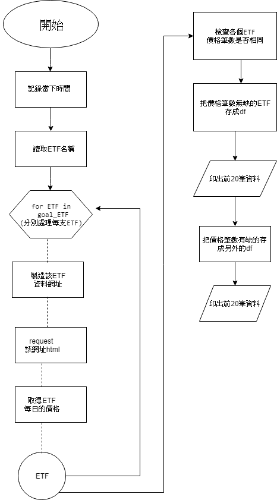

ETF 爬蟲_教學文件
======
## 1.選擇用甚麼樣的套件來做網路爬蟲?為什麼要用這個套件  
主要有import三個:  
1.datetime: 用來抓當下的日期, 以及轉換時間表示法, 給網址使用.  
2.requests: 用來讀取網頁的資料, 這次的資料就在網頁上. (然後使用split,append,等等來擷取、整理資料)  
3.pandas: 最後用來使用dataframe來展示爬取的資料的. (在這之前是用dictionary來存最後資料)  
  
## 2.流程圖 

## 3.五個當別人使用這個程式最有可能會遇到的錯誤情況，及解決辦法  
1.執行順序問題: 因為程式是由上往下寫的, 其中不少有下承接上的部分, 所以請要按找順序跑.  
2.讀檔問題: 程式讀的檔案是csv檔, 然後裡面第一格直接就是ETF的名子了, 所以要把xlsx存一個csv出來, 然後內容不需標題.  
3.資料來源: 由於盡量降低程式複雜度, 所以全用YahooFinance才有固定的價格格式以便擷取資料; 若資料是從其他平台, 要改一下價格資料來源及擷取方式的程式碼.  
4.ETF資料數量不同: 有些ETF會缺一些2015.12.1後的資料, 所以沒辦法跟大部分ETF一起完整顯示, 不過我有寫計算價格資料筆數的程式, 以找出那些ETF另外做展示.  
5.跑太久或是其他BUG: 因為不是資工背景等, 也沒學太久太精的Python, 所以很可能有不少問題未發現, 解決方式就是跟我討論或是自己查囉XD
